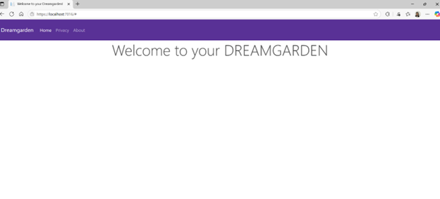
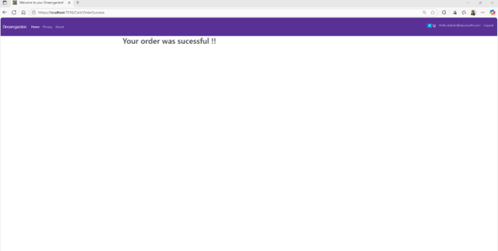
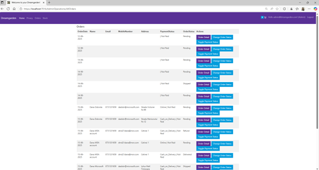
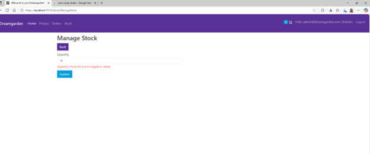

# Dev Academy Project "DreamGarden"
# Project: Order Management Platform for an Online Store!

# Short description
This project involves building a web application that allows users to browse products, place orders, and manage their purchases. It will be designed following Object-Oriented Programming (OOP) principles, leverage SQL Server for data persistence, expose functionalities via a RESTful API, and implement design patterns for maintainability and scalability. The project also requires integration with Postman/Fiddler for API testing and optimizations to improve performance.

For this project I have selected the ASP.NET Core Web App MVC template.

ASP.NET MVC is a framework for building web applications using the Model-View-Controller (MVC) design pattern. It's a lightweight, highly testable framework, and it's open-source apart from the Web Forms component, which is proprietary. 

MVC Pattern contains the following folders I have expanded and worked on :
• Model: Represents the data and business logic of the application -> here we retrieve information from the database, operated on it and then write the information back to SQL
• View: Displays the data to the user, worked on Razor  for displaying the user interface.
• Controller: Handles user input, interacts with the model, and chooses which view to display. 

# Technical Specs

• .NET core MVC
• MS SQLServer 2022 (Database)
• Entity Framework Core (ORM)
• Identity Core (Authentication)
• Bootstrap  (Front End)

# How to run the project

1.Take the latest code form the github repository and clone it to your VisualStudio
2.Open the appsettings.json file and update the connection string

! You need to have SQL Server installed locally on your machine

3. Run the project

# Administrative 

For this project, I have combined my passion for gardening with my technical skills. The database catalog features products and photos, all of which are sourced from my own home garden.
The images have been loaded inside the img folder of the ASP.NET wwwroot folder 

Due to the fact that these images were taking a lot of space when I started my initial commits, my project has exceeded the 100MB size.
I had issues committing multiple changes between 8-26 June.
This is the reason why there  is a huge gap inside my github Repository from 8 June…26 June. 
I continued my work constantly on my local VSO while trying to
-compress the images
-cleaned the solution+soft deleting
-usage of Git Large Files storage and tracking the problematic folders with the help of mentor.
None of these methods proved to be efficient, on 26 June I have uploaded the current state of build and eliminated the Dreamgarden.git folder, this is the reason why the successive commits are followed up upon the data 26 June.

For the authentication part I have used the ASP.NET Core Identity API to support the UI login functionality.

# SQL Structure

This project contains the following databases:

Having the following properties each:
The Flower Database contains the products in the shop
namespace DreamGarden.Models
{
    [Table("Flower")]
    public class Flower
    {
        public int Id { get; set; } //primary key in the database

        //annotations for the properties
        [Required]
        [MaxLength(50)]
        public string? FlowerName { get; set; }

        //annotations for the properties
        [Required]
        public string LatinName { get; set; }

        //anotations for the properties
        [Required]
        public string Description { get; set; }

        //annotations for the properties
        [Required]
        public double Price { get; set; }

        //annotations for the properties
        public string? Image { get; set; }

        //annotations for the properties
        [Required]
        public int GenreId { get; set; }

        public Genre Genre { get; set; } //connection with the Genre database; one flower has only one genre

        public List<OrderDetail> OrderDetail { get; set; } //connection with the OrderDetail database

        public List<CartDetail> CartDetail { get; set; } //connection with the CartDetail database

        public Stock Stock { get; set; }

        //not to be entered in the database
        [NotMapped]
        public string GenreName { get; set; }

        public int Quantity { get; set; }

    }
}

The Genre Database contains the type of plants which can be filtered out form the shop

    [Table("Genre")]
    public class Genre
    {
        public int Id { get; set; } //primary key in the database

        //annotations for the properties
        [Required]
        [MaxLength(50)]
        public string GenreName { get; set; }

        public List<Genre> Flowers { get; set; } //one Genre can have multiple flowers

The Order database which will keep the user ID, the data of the order, payment method + contact dates of the buyer

[Table("Order")]
public class Order
{
    public int Id { get; set; } //primary key in the database
    public string UserId { get; set; }
    public DateTime CreateDate { get; set; } = DateTime.UtcNow; //default time is now

    //annotations for the properties
    [Required]
    public int OrderStatusId { get; set; }

    public bool IsDeleted { get; set; } = false; //by default it is false

    [Required]
    [MaxLength(30)]
    public string? Name { get; set;}

    [Required]
    [EmailAddress]
    public string? Email { get; set; }

    [Required]
    public string? MobileNumber { get; set; }

    [Required]
    [MaxLength(200)]
    public string? Address { get; set; }

    [Required]
    [MaxLength(30)]
    public string? PaymentMethod { get; set; }

    public bool IsPaid { get; set; }

    public OrderStatus OrderStatus { get; set; } //connection with the OrderStatus database

    public List<OrderDetail> OrderDetail { get; set; } //connection with the OrderDetail database

The Order Status database which contains the possible states of the order (can be triggered by admin only)

 [Table("OrderStatus")]
 public class OrderStatus
 {
     public int Id { get; set; } //primary key in the database

      //annotations for the properties
     [Required]
     public int StatusId { get; set; }

     //annotations for the properties
     [Required]
     [MaxLength(20)]
     public string StatusName { get; set; }

The Order Detail database stores the products associated with each order, 

[Table("OrderDetail")]
public class OrderDetail
{

    public int Id { get; set; } //primary key in the database
   
    //annotations for the properties
    [Required]
     public int OrderId { get; set; }

    //annotations for the properties
    [Required]
    public int FlowerId { get; set; }

    //annotations for the properties
    [Required]
     public int Quantity { get; set; }

    //anotations for the properties
    [Required]
    public double UnitPrice { get; set; }
    public Order Order { get; set;} //linked to the Order Table

    public Flower Flower { get; set; } //link to the Flower Table
}

The Stock database which will contain the number of products available for purchase (can be managed by admin only)

    [Table("Stock")]
    public class Stock
    {
        public int Id { get; set; }
        public int FlowerId { get; set; }

        public int Quantity { get; set; }

        //foreign key
        public Flower? Flower { get; set; }

    }

After creating the database files under the Models I have used the following migration command inside Visual Studio
add-migration added-tables

For distinguishing the two different roles I have created a Class called Roles and stored it under the Constants folder.

 The Admin Role has been created using the following credentials:

 //create a default admin record with the following credentials
 var admin = new IdentityUser
 {
     UserName = "admin@dreamgarden.com",
     Email = "admin@dreamgarden.com",
     EmailConfirmed = true,
 
 };
 
 var ifUserExists = await userMgr.FindByEmailAsync(admin.Email);
 if(ifUserExists == null)
 {
     //create the user
     var result = await userMgr.CreateAsync(admin, "Secretpassword123!");
     if (result.Succeeded)
     {
         //add the user to admin role
         await userMgr.AddToRoleAsync(admin, Roles.Admin.ToString());
     }
 
The admin has been personalized inside the Layout page

Added some code inside the LoginPartial html -> to display (Admin) to distinguish the two roles.

 <li class="nav-item">
     <a  class="nav-link text-dark" asp-area="Identity" asp-page="/Account/Manage/Index" title="Manage">Hello @User.Identity?.Name!
         @if(User.IsInRole("Admin"))
         {
             //adding code to have (Admin) displayed near hello if this is a admin
             //Admin
             (Admin)
   }
     </a>
</li>

# Front End Design

The Layout HTML has been configured with a templated I have extracted from Bootstrapp 
https://getbootstrap.com/docs/5.3/getting-started/introduction

Inside the preconfigured wwwroot folder I have imported a template from bootswatch.com and references it in the Layout page

This was the initial Web page displayed.

As a next step I have added the genre type and the products (flowers) to the main page inside the Index.cshtml page

    
   <form class="row row-cols-lg-auto g-3 align-items-center">
   
  <!--Add genre selection-->
  

    <label class="visually-hidden" for="inlineFormSelectPref">Genres</label>
    <select class="form-select" id="genreId">
      <option selected>Choose...</option>
      <option value="1">Perennials</option>
      <option value="2">Full Sun Plants</option>
      <option value="3">Shade Plants</option>
      <option value="4">Evergreens</option>
 
    </select>
  

 
  <!--Add search bar-->
   

        <label class="visually-hidden" for="inlineFormInputGroupUsername">Search by flower name</label>
         

                

                <input type="text" class="form-control" id="" placeholder="Search by flower name">
                 

          

 
 
 
  

    <button type="submit" class="btn btn-primary"Search products</button>
  

</form>

As soon as I have populated the values inside the Flower Database for the products, I have displayed the products on the homepage.

# User functionality: search and filtering

Each user can search after a certain type of genre to know which products suits them the best.
The user can also search for a keyword to see if these products are present on the webpage.
These method has been implemented inside the HomeRepository.

 
 public async Task <IEnumerable<Flower>> GetFlowers(string sTerm = "", int genreId = 0)
 {
     //case insensitive search
     sTerm = sTerm.ToLower();
     IEnumerable<Flower> flowers=await (from flower in _db.Flowers
     //all columns are from Flower DB except for Genre which is from Genre DB
                    join genre in _db.Genres on flower.GenreId equals genre.Id
                    //join the stock DB
                    join stock in _db.Stocks on flower.Id equals stock.FlowerId into flower_stocks
                    from flowerWithStock in flower_stocks.DefaultIfEmpty()
                    //if the search teris empty or the flower name contains the search term
                    //where (string.IsNullOrEmpty(sTerm) || Flower.FlowerName.ToLower().Contains(sTerm)) && (genreId == 0 || Flower.GenreId == genreId)
                    where (string.IsNullOrWhiteSpace(sTerm) || (flower.FlowerName.ToLower().Contains(sTerm)) && flower!=null)
                    select new Flower
                    {
                        Id=flower.Id,
                        Image = flower.Image,
                        FlowerName =flower.FlowerName,
                        LatinName=flower.LatinName,
                        Description=flower.Description,
                        GenreId=flower.GenreId,
                        Price=flower.Price,
                        GenreName=genre.GenreName,
                        Quantity=flower.Stock==null?0:flower.Stock.Quantity
                    }
                    ).ToListAsync();

    
     //you want to filter after the genre
     if(genreId>0)
     {
         //if the genre ID is greater than 0, filter the flowers by genre ID
         flowers=flowers.Where(a=>a.GenreId == genreId).ToList();    

     }

     return flowers;

 }
 

Example:

Search after Waterplants
 

Result

Search after evergreens

Result

Search after flower name
Write Hydrangea

Correctly filtered out

Search is also case insensitive
Search after "red"
 
 
Result

It can filter out also words inside the whole flower name (not necessary by following the first letters).
 
Example "Japanese"

# User functionality: adding items to the cart/ adding and removing products/ checkout method

These methods have been implemented inside the  CartRepository class+its corresponding interface.
namespace DreamGarden.Repositories
{
    public class CartRepository : ICartRepository
    {
        private readonly ApplicationDbContext _db;
        private readonly UserManager<IdentityUser> _userManager;
        private readonly IHttpContextAccessor _httpContextAccessor;
 
        //constructor
        public CartRepository(ApplicationDbContext db,IHttpContextAccessor httpContextAccessor,UserManager<IdentityUser> userManager)
        {
            _db = db;
            _userManager = userManager;
            _httpContextAccessor = httpContextAccessor;
        }
 
        //method for adding to the cart
        public async Task<bool> AddItem(int flowerId, int qty)
        {
            //need transaction because we are doing changes in multiple databases.
            using var transaction = _db.Database.BeginTransaction();
            try
            {
 
                string userId = GetUserId();
                //if we do not find a user id then we will return a false value
                if (string.IsNullOrEmpty(userId))
                    return false;
 
                //move further and get the cart of the user
                var cart = await GetCart(userId);
                if (cart is null)
                {
                    //then create a new cart
                    cart = new ShoppingCart
                    {
                        UserId = userId
                    };
                    _db.ShoppingCarts.Add(cart);
                }
 
                _db.SaveChanges();
                //cart details section
                //if we have a record with these items 
                var cartItem = _db.CartDetails.FirstOrDefault(a => a.ShoppingCartId == cart.Id && a.FlowerId == flowerId); 
                if(cartItem is not null)
                {
                    cartItem.Quantity = cartItem.Quantity+qty;
                }
 
                else
                {
                    cartItem = new CartDetail
                    {
                        FlowerId = flowerId,
                        ShoppingCartId = cart.Id,
                        Quantity = qty
 
                    };
                    _db.CartDetails.Add(cartItem);
                }
                _db.SaveChanges();
                return true;
                
            }
            catch(Exception ex)
            {
                return false;
            }
        }
 
 
        //method for removing item
        public async Task<bool> RemoveItem(int flowerId)
        {
            using var transaction = _db.Database.BeginTransaction();
            try
            {
 
                string userId = GetUserId();
                //if we do not find a user id then we will return a false value to
                if (string.IsNullOrEmpty(userId))
                    return false;
 
                var cart = await GetCart(userId);
 
                //if you don't have a cart, removing an item is not an option.
                if (cart is null)
                {
                    return false;
                }
 
                _db.SaveChanges();
                //cart details section
                //if we have a record with these items 
                var cartItem = _db.CartDetails.FirstOrDefault(a => a.ShoppingCartId == cart.Id && a.FlowerId == flowerId);
                if (cartItem is null)
                    return false;
                else if(cartItem.Quantity==1)
                {
                    _db.CartDetails.Remove(cartItem);
                }
 
                //Decrease the quantity
                else
                {
                    cartItem.Quantity=cartItem.Quantity-1;
                }
                _db.SaveChanges();
                transaction.Commit();
                return true;
 
            }
            catch (Exception ex)
            {
                return false;
            }
        }
 
 
        //public method for returning the shopping cart
        public async Task<IEnumerable<ShoppingCart>> GetUserCart()
        {
            var userId = GetUserId();
            if (userId == null)
                throw new Exception("Invalid userid");
            //connect the tables ShoppingCart, CartDetails, Flower, Genre
            var shoppingCart =await _db.ShoppingCarts
                             .Include(a => a.CartDetails)
                             .ThenInclude(a => a.Flower)
                             .ThenInclude(a => a.Genre)
                             .Where(a => a.UserId == userId).ToListAsync();
            return shoppingCart;  
        }
 
        private async Task<ShoppingCart> GetCart(string userId)
        {
            var cart =await _db.ShoppingCarts.FirstOrDefaultAsync(x => x.UserId == userId);
            return cart;
        }
 
 
        private string GetUserId()
        {
            var principal = _httpContextAccessor.HttpContext.User;
            var userId = _userManager.GetUserId(principal);
            return userId;  
        }
    }
}
 
 
 

 
For displaying the number of products inside the cart a JavaScript has been used inside the Index.html
 
@* Define a JavaScript for displaying the number of elements in cart at the cart button *@

 
 
 
Reload Button inside Layout.html has been defined to keep the correct number of products in the cart even when the page is refreshed/changed.
 
 @* Define a JavaScript function to keep the number of items in cart after reloading page *@

    
 
 
 Example:

After you select the products from the cart, you can click on the cart symbol to see what you have added to the card.

Addin items when clicking on + button

Removing items when clicking on "-" button

The CartRepositoy contains also the Checkout procedure

public async Task<bool> DoCheckout()
  {
      using var transaction = _db.Database.BeginTransaction();
      try
      {
          //move data from cartDetail to order and order detail then we will remove cart detail
          var userId = GetUserId();
          if (string.IsNullOrEmpty(userId))
              throw new Exception("User is not logged in!");
          var cart = await GetCart(userId);
          if (cart is null)
              throw new Exception("Invalid cart");
          var cartDetail = _db.CartDetails.Where(a => a.ShoppingCartId == cart.Id).ToList();
 
          if (cartDetail.Count == 0)
              throw new Exception("Cart is empty!");
 
          var order = new Order
          {
              UserId = userId,
              CreateDate = DateTime.Now,//Utc.Now
              OrderStatusId = 1, //pending
          };
          _db.Orders.Add(order);
          //get the order ID
          _db.SaveChanges();
          foreach (var item in cartDetail)
          {
              var orderDetail = new OrderDetail
              {
                  FlowerId = item.FlowerId,
                  OrderId = order.Id,
                  Quantity = item.Quantity,
                  UnitPrice = item.UnitPrice
              };
              _db.OrderDetails.Add(orderDetail);
          }
 
          _db.SaveChanges();
 
          //remove the cart details
          _db.CartDetails.RemoveRange(cartDetail);
          _db.SaveChanges();
          transaction.Commit();
          return true;
      }
 
      catch (Exception)
      {
          return false;
      }
 
  }

  Example

Unless you specify the checkout method, it will fail

Afterwards the order will be placed successfully!

# Admin Operations: Show Orders 

The list of options for admins on the Homepage has been extended with some additional features.

The part with Sowing the orders from the users-> has been implemented from the UserOrderRepositoy + AdminOperationsController

Order View
 
When you click on Order Detail

When you click on Change Order Status
 
And update the status of the orders

Example
 
To shipped

# Admin Operations: Stock Functionality 

-> the methods are implemented inside the StockRepository and the corresponding  StockController

If stock is updated to 0, then an out of stock icon is displayed in the view.
 
Index.Html
 
    @* <button type="button" onclick="add(@flower.Id)" class="btn btn-primary">Add to cart</button> *@
    @if (flower.Quantity > 0)
    {
        <button type="button" onclick="add(@flower.Id)" class="btn btn-primary">Add to cart</button>
    }
    else
    {
        Out of stock
    }

 

# Admin Operations: Managing genre types 

Using the Genre Repository

public class GenreRepository : IGenreRepository //implement the defined interface
{
    private readonly ApplicationDbContext _context;

    //inject the ApplicationDbContext into the repository through the constructor
    public GenreRepository(ApplicationDbContext context)
    {
        _context = context;
    }

    //implement all the methods defined in the interface, this ones will be managable by the Admin Interface only
    public async Task AddGenre(Genre genre)
    {
        _context.Genres.Add(genre);
        await _context.SaveChangesAsync();
    }
    public async Task UpdateGenre(Genre genre)
    {
        _context.Genres.Update(genre);
        await _context.SaveChangesAsync();
    }
    public async Task<Genre?> GetGenreById(int id) =>
        await _context.Genres.FindAsync(id);
    public async Task DeleteGenre(Genre genre)
    {
        _context.Genres.Remove(genre);
        await _context.SaveChangesAsync();
    }
    public async Task<IEnumerable<Genre>> GetGenres() =>
        await _context.Genres.ToListAsync();

Clicking on add more

Change reflected in the database as well

And in the UI

Clicking on delete for this new category

Removes the category from the UI

And from the database

# Admin Operations: Add/update/delete products from Admin View 

->has been implemented in Flower Repository and its Flower Controller

And also in the database we can see the change

For adding new products

New entry is visible on the Admin Side

And in the database

You can also delete it

And the item will be removed from the view and from the database

# Admin Operations: Reporting

Top Selling Flowers

Run the following stored procedure in SQL

Stored Procedure in SQL
 
CREATE PROCEDURE[dbo].[Usp_GetTopNSellingFlowersByDate]
@startDate datetime, @endDate datetime
As 
Begin
 
SET NOCOUNT ON;
 
With UnitSold as
(
Select od.FlowerId, SUM(od.FlowerId) as TotalUnitSold from [order] o
Join OrderDetail od on o.Id=od.OrderId
WHERE o.IsPaid=1 and o.IsDeleted=0 and o.CreateDate between @startDate and @endDate
GROUP BY od.FlowerId
)
 
--Select top 5 Flowers which are sold
SELECT TOP 5 b.FlowerName,b.LatinName,us.TotalUnitSold
FROM UnitSold us
JOIN [Flower] b
ON us.FlowerId=b.Id
ORDER BY us.TotalUnitSold DESC
END
 
UPDATE[order] set IsPaid=1

And call the stored procedure inside the Report Repository.

   public async Task<IEnumerable<TopNSoldFlowerModel>> GetTopNSellingFlowersByDate(DateTime startDate, DateTime endDate)
   {
       var startDateParam = new SqlParameter("@startDate", startDate);
       var endDateParam = new SqlParameter("@endDate", endDate);
       //call method to get the result of the stored procedure from SQL which gives the top 5 selling flowers
       var topFiveSoldFlowers = await _context.Database.SqlQueryRaw<TopNSoldFlowerModel>("exec Usp_GetTopNSellingsByDate @startDate,@endDate", startDateParam, endDateParam).ToListAsync();
       return topFiveSoldFlowers;
   }

For total sales per month
 
  SELECT SUM(UnitPrice) from [OrderDetail]
 

# Testing with Fiddler

When adding to cart
 
GET https://localhost:7016/Cart/GetTotalItemInCart
200 OK (application/json)
 

GET https://localhost:7016/Cart/AddItem?flowerId=12
200 OK (application/json)

Order succesful
POST https://localhost:7016/Cart/Checkout
302 Redirect to /Cart/OrderSucces
 
GET https://localhost:7016/Cart/OrderSuccess
200 OK (text/html)

Corresponds to this webview

Testing Admin API
Adding a new Genre category from admin and removing it
 

POST https://localhost:7016/Genre/AddGenre HTTP/1.1
Host: localhost:7016
Connection: keep-alive
Content-Length: 241
Cache-Control: max-age=0
sec-ch-ua: "Microsoft Edge";v="137", "Chromium";v="137", "Not/A)Brand";v="24"
sec-ch-ua-mobile: ?0
sec-ch-ua-platform: "Windows"
Origin: https://localhost:7016
Content-Type: application/x-www-form-urlencoded
Upgrade-Insecure-Requests: 1
User-Agent: Mozilla/5.0 (Windows NT 10.0; Win64; x64) AppleWebKit/537.36 (KHTML, like Gecko) Chrome/137.0.0.0 Safari/537.36 Edg/137.0.0.0
Accept: text/html,application/xhtml+xml,application/xml;q=0.9,image/avif,image/webp,image/apng,*/*;q=0.8,application/signed-exchange;v=b3;q=0.7
Sec-Fetch-Site: same-origin
Sec-Fetch-Mode: navigate
Sec-Fetch-User: ?1
Sec-Fetch-Dest: document
Referer: https://localhost:7016/Genre/AddGenre
Accept-Encoding: gzip, deflate, br, zstd
Accept-Language: en-US,en;q=0.9,de-DE;q=0.8,de;q=0.7,ro;q=0.6
Cookie: .AspNetCore.Antiforgery.uBBNRsF215Q=CfDJ8KB_WUTGIfFAgHWrA2Z521k5Zc4CTKwknndr9zutXL2qiBKiLA3RY5PskBDmTtb5ogvHtaDN607_AIJJzcUf2aPPwpvYccqr4aduMEuedn48c2_cNoSbPq-QL4EINzpL5cEHL91OySh_A-raVtO2gLY; .AspNetCore.Antiforgery.n7AVgtcaV1Y=CfDJ8KB_WUTGIfFAgHWrA2Z521lbbHQIwCf-wylNVFIzsE0xbPj9dxIXYs5BogQyDhnzaVxlAg69KCo8US51yLxZqndDZ_e_8apix94FpLS7H6ikwWzyGDChrtUF3bSaRtiOPlo14ZRe7PBikz8Uq5zafqs; .AspNetCore.Antiforgery.xPCNeZotDx4=CfDJ8KB_WUTGIfFAgHWrA2Z521l6cFY4uirRuv2v_givN1M_VvoouCIk0-alWX0yR7Kw3K0RiXGt58bdtgJ-RrCqXTdK53aZqpBIO6_jTC8IpysoqaSr9C3eBVHGkI8GjZcFpeCGdM6k2ejoFg7f7LwVPNc; .AspNetCore.Antiforgery.89qcuchBoX4=CfDJ8KB_WUTGIfFAgHWrA2Z521mcnSWoTmlUT5WHovSQGs-g6pmawMjBnfqrxVqC2atzVezdj5VhX0b_GK--Qred3y9KH_Fb5IAxzuznulNbHW6na3mSgS_2bUcbVrYIXpVpE70F6u8V-WHyZUZ7H6KApag; .AspNetCore.Antiforgery.OQB4tqJOFFo=CfDJ8KB_WUTGIfFAgHWrA2Z521mhtAo5jhHfG_cDTo2IkVDGcVczsR0ov_35HTfHKrrJA1vwtezG_hfeZvc-_4uy0RnK1UWvjceW5mYbFdtsPcmNgV0cKKe0UIVQRrf4hg0_LDRD1Q5CJWBZxDqzhXWe78o; .AspNetCore.Antiforgery.JQ65oM0SXpo=CfDJ8KB_WUTGIfFAgHWrA2Z521n1XUuvAhV_GenfyJacDVDx-0WtkJh96J95m4jODUQz_ake10zjBi5eSTqWvJmufUeCljA0X7uYaW5iL9k0gI7MxVoe7KNsABYdK4Zo9TInpNhxgQacjwxxH8Ck0-NBRMo; .AspNetCore.Identity.Application=CfDJ8KB_WUTGIfFAgHWrA2Z521nT8mtIMwGG71YlGvmX3p11wSxb9dTimkM6ZFbGaL3oddcKqhXLn02V2i5Wky_OncOj_tCnKJOyNKXLI2E-OLRF9bF98AchNsBRJmrU_-gONF7cEUn8qBWjt-UNXaUin7wYYpxU5fHpgvsp6SjZ829SR-JkQ5ASgAFZjYQAGt4Kd99CKappeXGrRUEWYBNbM1sB-__k-Jz8EKHX19b-1mMenwpN5I9vsgCVDtGPPza81d4FcradxYpuhcgWhSZJZpUGBKunvRDsv9JUqFqJrKaZZjCYzlx_pjTIDydmSCgBdliRnsKsSId8gfNvkO3-OX6MFjjiNZ2H6S4jYdgNur7vgZJsNF-aU3b4k3L71gAL8AFWKYoVzqhSU3w26p0XH6YyTVwkGU4NLcvwyNPlI9hHIoK4saB4jKuPaSFmBdxo8EVNgYnm0UrWfBcwLZpf20LOyuzXWHVC6O_PKSYF6UdrUl0icZa7XSbzq5fblWaG9ckxmuPj7WgiNUVIqIo704iiGWAXGl7oqZW99zO5SOQ3WC-TypNzQ0JGbx4lv2Gfju3ls1V9zrXX5nDtgPEJp_r96RVXVTjZ2ZNp6TqRc8PiEm9zDdHfJZtmfCkH-KQSBh20vStA_tbA3R0c0U7YvwEWD_5pd8fNzwlMARMP_jf8Vg3HY6VwGH7Li0vy9bIZ1wfcV-nXKBnQ9wK3lK-GsuznnWC5tiRYnXoiAuEdb6JfQtTVquXHQJgHwSpSWufNW-Gz1JgJXiAZ-NK404a42UylN0Xq84dX8oFkwdeQ4U22Cv7FSIFT_x3RHxPUz0eQlbKmY3-sMqnySCdlf4DVsyV2gGR5TFvXCQW0YpdFkLwZ
 
GenreName=Trees&__RequestVerificationToken=CfDJ8KB_WUTGIfFAgHWrA2Z521mhpNb649Ox-FWSwguD9XelJKSN9IfvDF7RWenlH6HkXeaD6C0ckR7bVnIZ1N35Nry_Hc0IuDnsqpBf5eTHhAQwZsyTTO9NaaGhuRnqGPPwsXxe5N6yrV7mLxTEopnsuLXfqt6uJmjVKiTtkJHIcR3StUrLbSeeXrHvthx2s4FH_w
HTTP/1.1 302 Found
Content-Length: 0
Date: Sun, 22 Jun 2025 14:31:40 GMT
Server: Kestrel
Location: /Genre/AddGenre
Set-Cookie: .AspNetCore.Mvc.CookieTempDataProvider=CfDJ8KB_WUTGIfFAgHWrA2Z521mLMtkH1aMdt1vc-jMHaJNR7OgI1_8MjnRamxeQKVhgx0L0-mCnDcqCv15-JTTV0SLoCd4-VUiz1juCAb-MSME0iO8pyr8nH2IpZ7RsTAZ-ZwtVlUk8BlLBwqXpEXciuxdwwH64HwCFJfJp0Z4HJCro; path=/; samesite=lax; httponly
 
 
GET https://localhost:7016/Genre/DeleteGenre/10
302 Redirect to /Genre
 
 
GET https://localhost:7016/Genre
200 OK (text/html)
 
 
 
 
Now we open the composer field from Fiddler

Request:
https://localhost:7016/Home/Index

Response is 200 OK when launching the webpage

This corresponds when changing the webview to

Testing POST using Fiddler
 
POST /Cart/Checkout HTTP/1.1
HTTP/1.1 200 OK
 
 
POST https://localhost:7016/Cart/Checkout
200 OK (text/html)

# Unit Testing

Mocking the Stock Controller
 
using DreamGarden.Controllers;
using DreamGarden.Repositories;
using DreamGarden.Models.DTOs;
using Moq;
using NuGet.Protocol;
 
namespace test
{
    public class StockControllerTests
    {
        [Fact]
        public async Task Test_Index_Calls_GetStocks()
        {
            var mockRepo = new Mock<IStockRepository>();
            var controller = new StockController(mockRepo.Object);
            
            mockRepo.Setup(repo => repo.GetStocks(It.IsAny<string>()))
                .ReturnsAsync(new List<StockDisplayModel> { new StockDisplayModel { FlowerId = 1, Quantity = 10 } });
            
            await controller.Index("testTerm");
 
            Assert.Equal(1, mockRepo.Invocations.Count);
        }
    }
}
 

